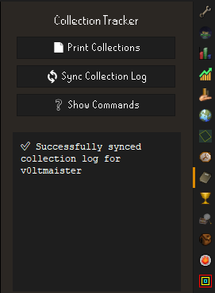
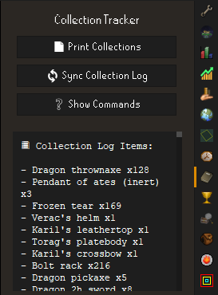
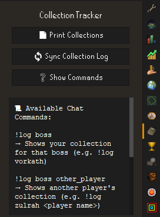
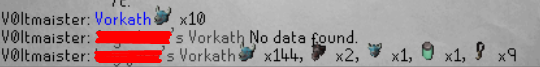

# 📘 Collection Tracker

A RuneLite plugin that tracks your **Collection Log** progress and allows you to view collection data for yourself or other players via chat commands or a convenient UI panel.

---

## ✨ Features

- 📦 **Sync your collection log** directly from [TempleOSRS](https://templeosrs.com/)
- 🧾 **Print all your collected items** to the plugin side panel
- 🔍 **Query other players' collection logs** using in-game chat commands
- 🧠 **Smart aliasing** for common boss and minigame names  
  _e.g. `!log TOA` works for "Tombs of Amascut"_
- 📀 **Local database caching** with pruning to keep it clean and fast

---

## 🚀 Usage

### ▶️ Plugin Panel

Once the plugin is enabled:

1. Click the **Collection Tracker** icon in the RuneLite sidebar.
2. Use the available buttons

<div align="center">

| Button | Function |
|--------|----------|
| 📄 **Print Collections** | Display your synced items |
| 🔄 **Sync Collection Log** | Sync your data with TempleOSRS |
| ❓ **Show Commands** | See how to use chat commands |

<br>

### 🖼️ Panel Previews

<table>
  <tr>
    <td align="center"><strong>📦 Main Panel</strong><br></td>
    <td align="center"><strong>🔄 Sync</strong><br></td>
    <td align="center"><strong>📋 View Items</strong><br></td>
    <td align="center"><strong>❓ Commands</strong><br></td>
  </tr>
</table>

</div>

---

### 💬 In-Game Commands

Use these in public, private, or clan chat:

#### View Your Collection
```text
!log boss
```
_Example: `!log vorkath`_

#### View Another Player's Collection
```text
!log boss playername
```
_Example: `!log zulrah hey jase`_

#### 🔀 Supported Aliases
Commands like `toa`, `tob`, `arma`, `graardor`, `vetion`, etc. are smart-mapped to their full names.

---

### 💬 Example Output

<div align="center">
  
</div>

---

## 📍 Data & Storage

- Synced using TempleOSRS public API
- Stored locally using an **H2 embedded database**
- Prunes older player logs automatically

---

## 🛠️ Development

No additional configuration needed. Just install and go.

### Requirements
- Java 11
- RuneLite Plugin Dev Environment

---

## 🤝 Credits

- Inspired by the original OSRS Collection Log and TempleOSRS API
- Built using the RuneLite plugin API
- Created by [Voltmaister](https://github.com/Voltmaister)

---

## 📄 License

MIT – Free to use, modify, and share ❤️
