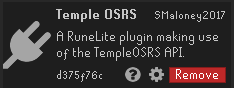
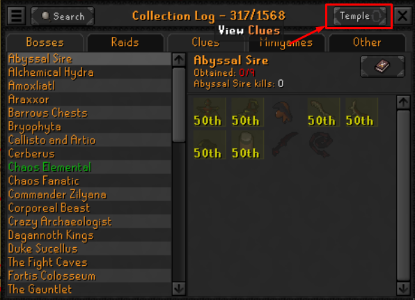
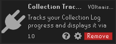
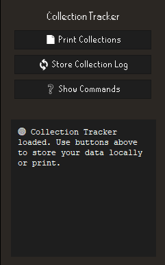
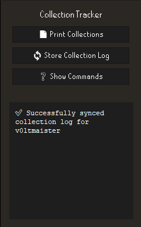
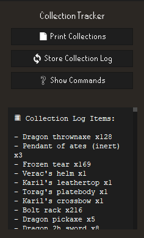
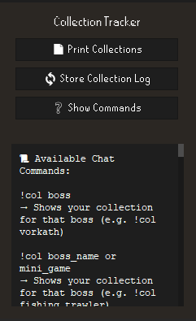

# 📘 Collection Tracker

A RuneLite plugin that tracks your **Collection Log** progress and allows you to view collection data for yourself or other players via chat commands or a convenient UI panel.

---

## ✨ Features

- 📦 **Sync your collection log** directly from [TempleOSRS](https://templeosrs.com/)
- 🧾 **Print all your collected items** to the plugin side panel
- 🔍 **Query other players' collection logs** using in-game chat commands
- 🧠 **Smart aliasing** for common boss and minigame names  
  _e.g. `!col TOA` works for "Tombs of Amascut"_
- 📀 **Local database caching** with pruning to keep it clean and fast

---
## 🚀 How to Use


### Step 1: Install the Temple OSRS Plugin  
Start by installing the <strong>Temple OSRS</strong> plugin from the RuneLite Plugin Hub.
<div align="center">

</div>


### Step 2: Sync Your Collection Log  
Sync your collection log data to the <a href="https://templeosrs.com">TempleOSRS website</a>.

<div align="center">

</div>


### Step 3: Install the Collection Tracker Plugin  
Next, install the <strong>Collection Tracker</strong> plugin from the Plugin Hub.

<div align="center">

</div>


---

### ▶️ Plugin Panel

Once the plugin is enabled:

1. Click the **Collection Tracker** icon in the RuneLite sidebar.
2. Use the available buttons

<div align="center">

| Button                      | Function                      |
|-----------------------------|-------------------------------|
| 📄 **Print Collections**    | Display your synced items     |
| 🔄 **Store Collection Log** | Get your data from TempleOSRS |
| ❓ **Show Commands**         | See how to use chat commands  |

<br>

### 🖼️ Panel Previews

<table>
  <tr>
    <td align="center"><strong>📦 Main Panel</strong><br></td>
    <td align="center"><strong>🔄 Store Items</strong><br></td>
    <td align="center"><strong>📋 View Items</strong><br></td>
    <td align="center"><strong>❓ Commands</strong><br></td>
  </tr>
</table>

</div>

---

### 💬 In-Game Commands

Use these in public, private, or clan chat:

#### View Your Collection
```text
!col boss
```
_Example: `!col vorkath`_

#### View Another Player's Collection
```text
!col boss playername
```
_Example: `!col zulrah player name`_

#### Minigame and Long Named Bosses
```
!col mini_game 
!col boss_name
```
_Example: `!col general_graardor`_
`!col fishing_trawler`

In contrary to player names that don't need an underscore to function properly, boss names and minigame names have to otherwise they get mistaken for player names.

#### 🔀 Supported Aliases
Commands like `toa`, `tob`, `arma`, `graardor`, `vetion`, etc. are smart-mapped to their full names.

---

### 💬 Example Output

<div align="center">
  
</div>

---

## 📍 Data & Storage

- Synced using TempleOSRS public API
- Stored locally using an **H2 embedded database**
- Prunes older player logs automatically

---

## 🛠️ Development

No additional configuration needed. Just install and go.

### Requirements
- Java 11
- RuneLite Plugin Dev Environment

---

## 🤝 Credits

- Inspired by the original OSRS [Collection Log by evansloan](https://github.com/evansloan/collection-log) and [TempleOSRS API](https://templeosrs.com/api_doc.php)
- Built using the RuneLite plugin API
- Created by [Voltmaister](https://github.com/Voltmaister)

---

## Known Issues (Pending Fix)

~~- **Player names with spaces:**  
  If your in-game name contains spaces (e.g., `good name` instead of `good_name`), your collection log data may not display correctly.  
  As a temporary workaround, use the command with your name exactly as it appears, including spaces:~~

  ```
  instead of 
  !col boss
  try 
  !col boss good name
  ```

~~- **Aliases for bosses and minigames:**  
  Alias support is coming in the next update. Until then, please use the full name of the boss or minigame with underscores between words. For example:~~

  ```
  !col fishing_trawler
  ```
